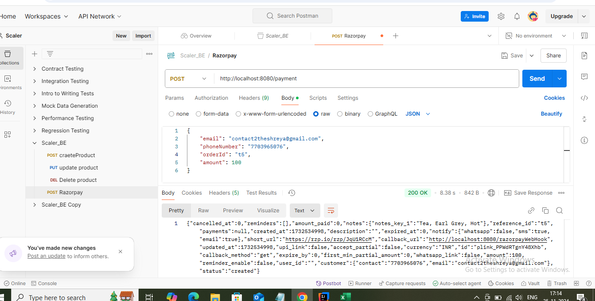
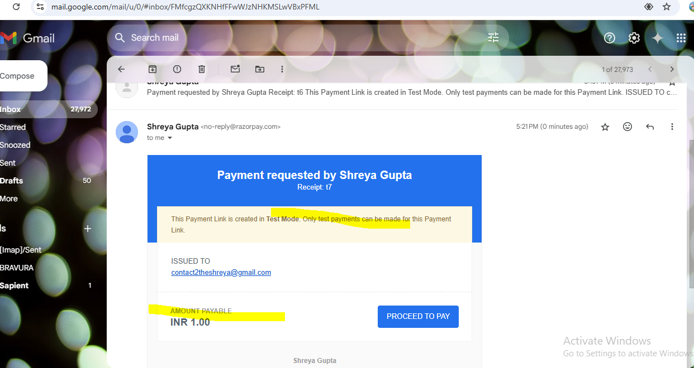

https://kinsta.com/blog/stripe-java-api/#:~:text=To%20begin%20the%20Stripe%20integration,clear%20understanding%20of%20their%20mechanisms
whenever u want to conncet with 3rd party api ,u need to store api key and api secret
send key and secret to razorpay
https://razorpay.com/docs/payments/server-integration/java/install/
https://razorpay.com/docs/payments/server-integration/java/payment-gateway/build-integration/
https://razorpay.com/docs/api/orders/
https://razorpay.com/docs/api/authentication/#generate-api-keys
https://razorpay.com/docs/api/orders/create/
https://github.com/7sandeepsinha/PaymentServiceMar24/blob/master/src/main/java/dev/sandeep/EcomPaymentService/controller/PaymentController.java
see
https://www.youtube.com/watch?v=7JAf5Rzp3Dg
https://youtu.be/DdFFuifQgXc
https://www.youtube.com/watch?v=fxOm1ENqhw8
razorpay accoun t-signup with gmail
199899 - digilocker security pin

Now u get mail in your mail
