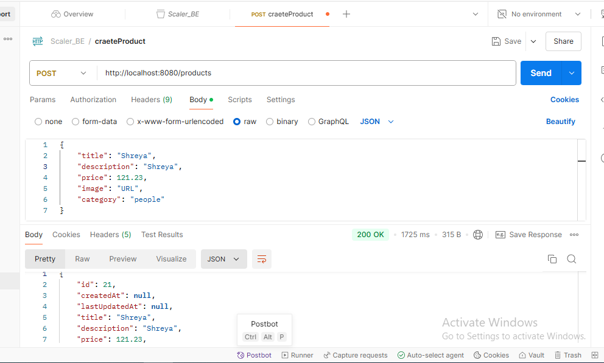
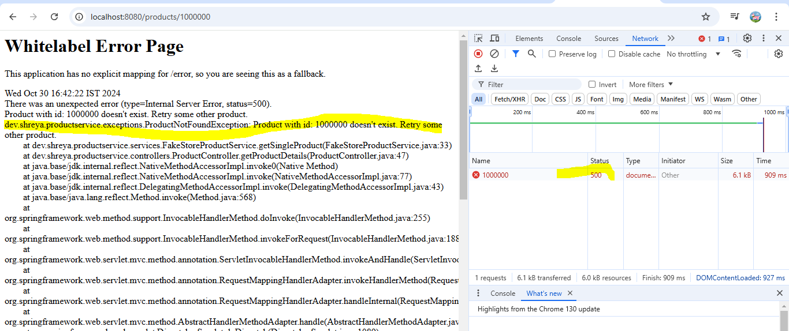
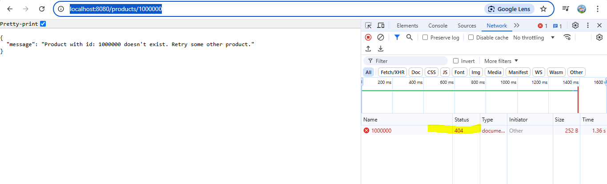
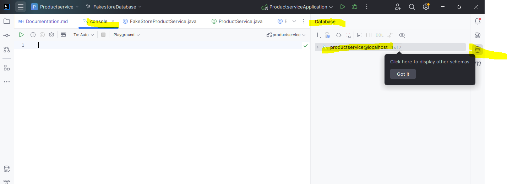
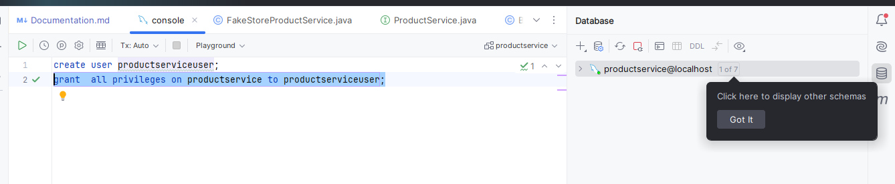
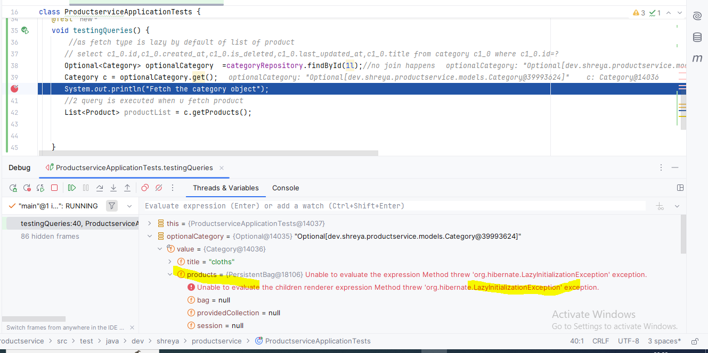
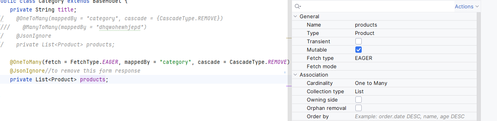
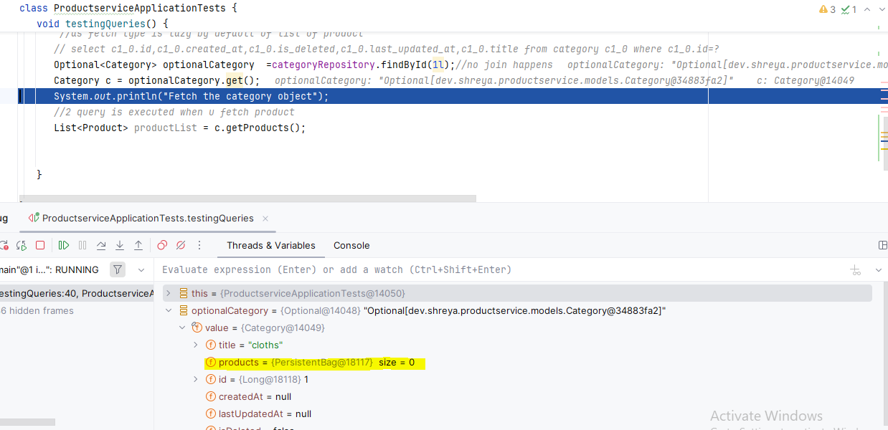
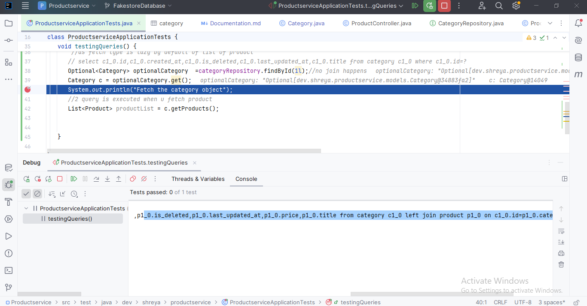
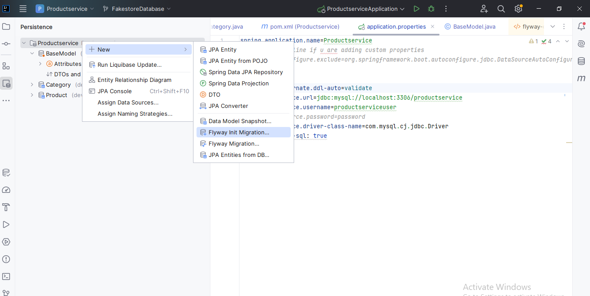

## Error Documentation
1) Maven resources compiler: Maven project configuration required for module 'MyFirstSpringProject' isn't available. Compilation of Maven projects is supported only if external build is started from an IDE

Solution - Right-click on pom.xml and then click on "Add as Maven Project". 

2) Failed to configure a DataSource: 'url' attribute is not specified and no embedded datasource could be configured 

Solution - https://www.baeldung.com/spring-boot-failed-to-configure-data-source

Worked - adding in application .prop

spring.autoconfigure.exclude=org.springframework.boot.autoconfigure.jdbc.DataSourceAutoConfiguration

 Parameter 0 of constructor in dev.shreya.productservice.controllers.ProductController required a single bean, but 2 were found:- fakeStoreProductService,selfProductService:
Productcontroller is confused which one to put in constructor injection so use @Qualifier

TO RUN
Read - https://www.geeksforgeeks.org/spring-boot-rest-template/
http://localhost:8080/products/1
https://fakestoreapi.com/docs
Post request - postman signin with google

# Exceptions
 Without controlelr advice
 http://localhost:8080/products/1000000

With controller advice

Github link for fakestore all api-
https://github.com/abhishek621/fakestore-api/tree/master

https://developer.mozilla.org/en-US/docs/Web/HTTP/Status

# Database
https://www.google.com/search?q=mysql+install+windows+11&oq=mysql+install+windows+11&gs_lcrp=EgZjaHJvbWUyBggAEEUYOTIICAEQABgWGB4yCAgCEAAYFhgeMggIAxAAGBYYHjIICAQQABgWGB4yCAgFEAAYFhgeMggIBhAAGBYYHjIICAcQABgWGB4yCAgIEAAYFhgeMggICRAAGBYYHtIBCDYwODlqMGo3qAIAsAIA&sourceid=chrome&ie=UTF-8#fpstate=ive&vld=cid:6db871d0,vid:a3HJnbYhXUc,st:0
https://docs.spring.io/spring-data/jpa/reference/jpa/query-methods.html
https://www.baeldung.com/jpa-cascade-types
https://spring.io/guides/gs/accessing-data-mysql
https://docs.spring.io/spring-data/jpa/reference/jpa/query-methods.html
https://www.baeldung.com/jpa-cascade-types
https://docs.spring.io/spring-data/jpa/reference/repositories/query-methods-details.html
https://docs.spring.io/spring-data/jpa/reference/repositories/query-keywords-reference.html
https://docs.spring.io/spring-data/jpa/reference/jpa/query-methods.html
https://www.baeldung.com/hibernate-inheritance
# FetchType
https://medium.com/destinationaarhus-techblog/how-to-implement-an-sql-join-with-jpa-6c5ff23bb7a6
https://stackoverflow.com/questions/26601032/default-fetch-type-for-one-to-one-many-to-one-and-one-to-many-in-hibernate
https://stackoverflow.com/questions/2990799/difference-between-fetchtype-lazy-and-eager-in-java-persistence-api
https://www.baeldung.com/hibernate-lazy-eager-loading

Postman collection 
Click on database icon on intellij and add datasource ->without providing DB
NOw run this in console

create database productservice;
drop user productserviceuser;
create  user productserviceuser;
use productservice;
grant all privileges on productservice to productserviceuser;

Lazy fetch type

As not able to fetch product

If u make fetch type eager in category model for list of product

Now left join happens with product table when u fetch category

https://www.baeldung.com/database-migrations-with-flyway
https://www.baeldung.com/spring-data-jpa-query
https://www.baeldung.com/hibernate-fetchmode
## FLYWAY
Add dependency of flyway
delete table
change ddl-auto to validate
In base model make generation type identity in ID
Do flyway init migration from persistence tab  and now db.migration filder -> version1 init sql file is created
Restart application ->now all tables will be cretaed

Which contains query to craete table
Now add attribute quantity in product table->do flyway versioned   migration now new version of changes and give name of file then new version file is created
Restart application ->now all tables will be cretaed
