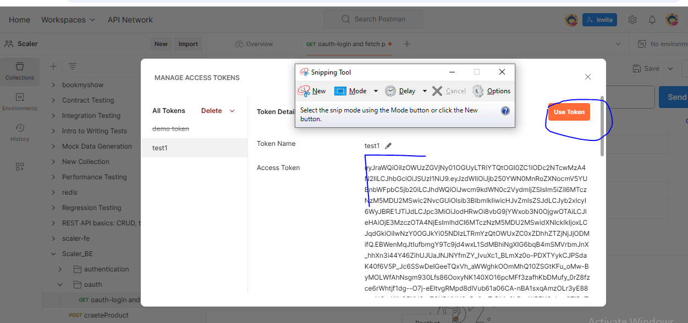
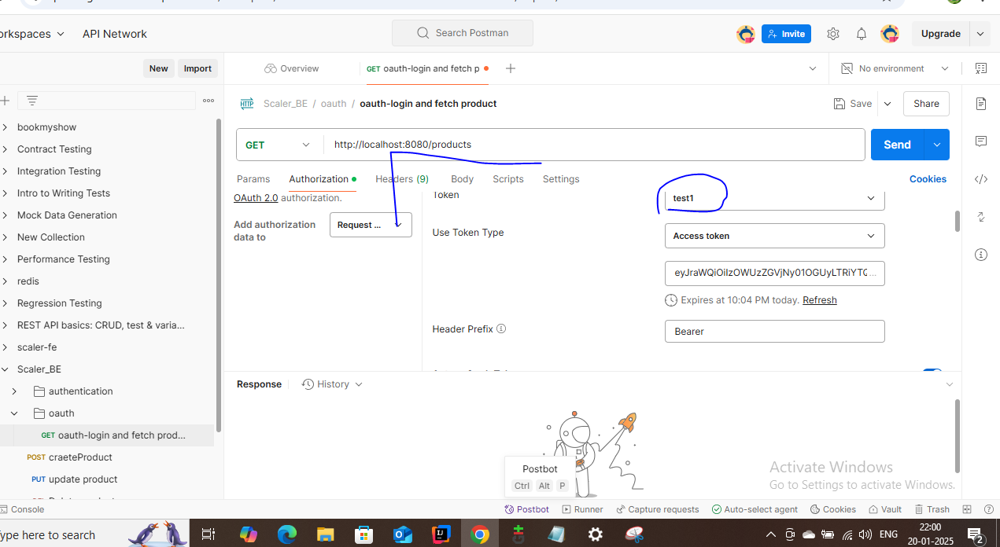
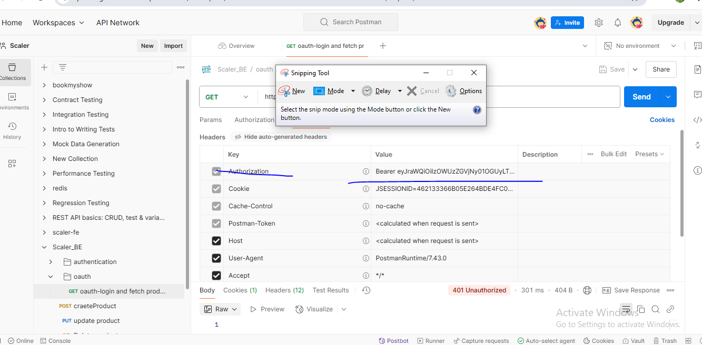
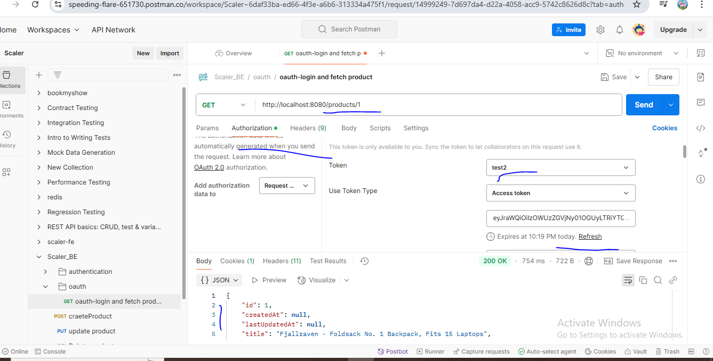

1) Add resource server dependency in pom
2) Add in app.prop
3) add security package
4) https://docs.spring.io/spring-security/reference/servlet/oauth2/resource-server/jwt.html
5) before controller request goes to filter chain
6) run request of productservice and in authorization tab hit authentication service and generate and use token
7) 
8) 
9) 
10) this toke is passed as header
11) 
12) token should not be expired
6) postman collection check named oauth login in same folder
7) product service will send request to userservice to validate token
# Role based authentication
Add role to acess which url in security config
use jwtconverter to read custom roles to decode jwt in custom way
as in authentiaction service we have manually added roles in claims by default jwt does not have that feture so we have to manually read this in product service using custom converter