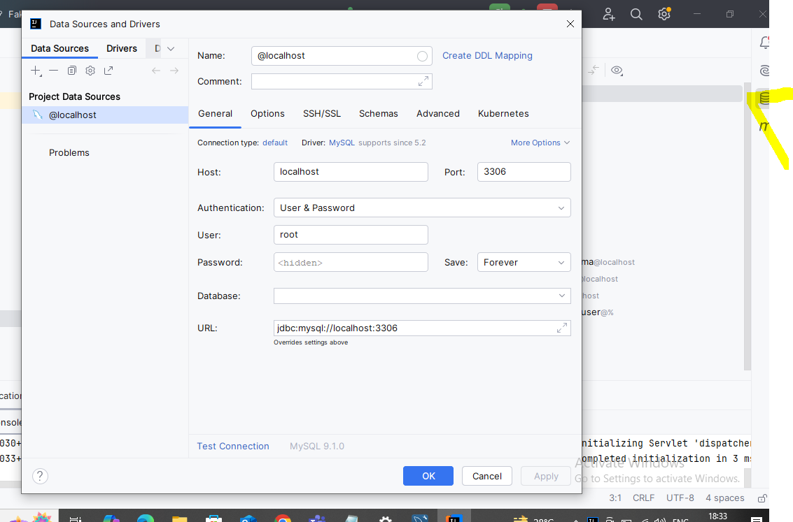
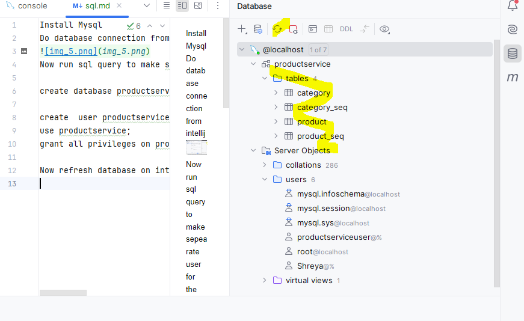

Install Mysql
Add mysql dependency and add in app.prop and exclude line 2)  if u are adding custom sql properties with new user 
Note-new user has no password
Do database connection from intellij

Now run sql query to make sepearate user for the database and make sure u are creating fresh database from intellij

create database productservice;

create  user productserviceuser;
use productservice;
grant all privileges on productservice.* to productserviceuser;

Now refresh database on intellij and see tables

Note seqence table is autogenerated
