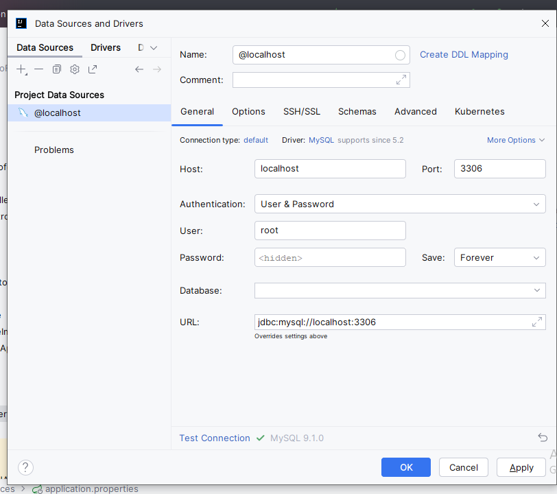

## This is sample Redis application

* First run redcis using command in notes.md
* create db by first open workbench
* 
* Run query-
* create database redisDemo;
* postman collection in project
create user redisUser;
use redisDemo;
grant all privileges on redisDemo.* to redisUser;
* run  project
## steps
* @EnableCaching in main class to enable cache
* with cache data shoul dget directly returned from controller without going to service layer
* object should be serialized for redis to understandn so car implements serializable
* cache will store car object so return type of api should be car object not responseentity
* if a data is not in cache then first time on get call it will go in service layer and next time when u hit again control will not go in service layer coz data is stored in cache now