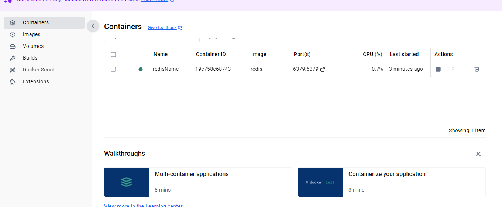
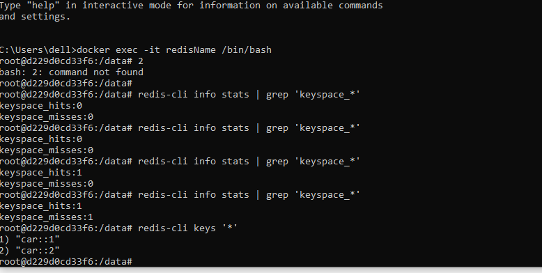
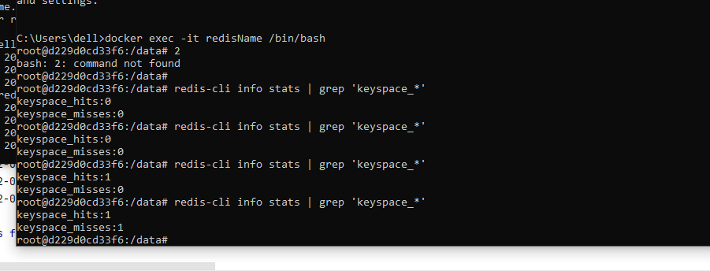

Install docker -https://youtu.be/XgRGI0Pw2mM
and open docker desktop
Run below command in command lin e in system home path

* docker pull redis  -> downloads the container and all required dependencies on docker
* docker run -p 6379:6379 --name redisName redis -> runs redis instance called redisName on port 6379
u will see in docker desktop redis entry is present and u can stop from there also

* docker exec -it redisName /bin/bash -> if you need to execute any commands on the redis instance

redis-cli info stats | grep 'keyspace_*' -> shows number of cache hit and cache miss
redis-cli FLUSHDB -> clear your cache
redis-cli keys '*' -> get information for all cache keys

cars
100 cars
101th car -> choose to remove 1 car || decided via Cache Eviction Policy

LRU cache -> Least Recently Used Cache
LFU cache -> Least Frequently Used Cache

https://medium.com/@kasunaratthanage/setting-up-the-redis-server-in-your-local-machine-11eca70ebf65
https://www.baeldung.com/jackson-custom-serialization
https://medium.com/@MatthewFTech/spring-boot-cache-with-redis-56026f7da83a
https://github.com/sndpoffcl/SpringCacheRedis
## see schedueltas.java and use @Eablescheduling
Cron Scheduling format -
*    *    *    *     *     *
sec  min  hour day  Month dayofweek

0 0 9 * * * -> everyday at 9 AM
0 30 9 * * *  -> everyday at 9:30 AM
0 30 9 * * 1 -> every monday[1] at 9:30 AM

0 * * * * * -> run every minute post deployment
* * * * * * -> run every second post deployment
            0 0 * * * * -> run every hour post deployment
put debugger in code and check after debug time